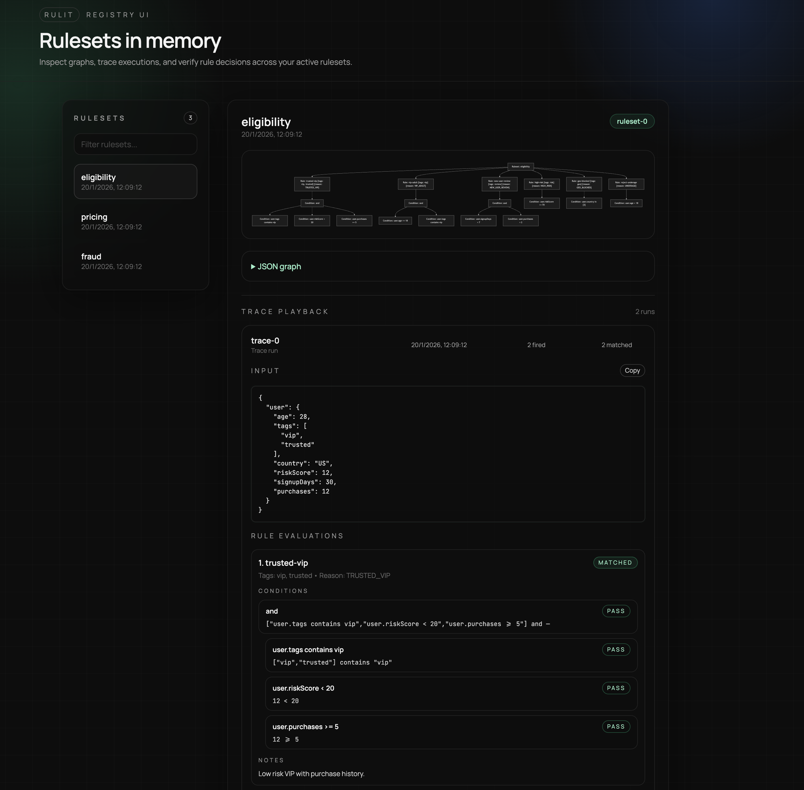

<p align="center">
  
</p>

# Rulit

Type-safe rules engine with a fluent builder API and explainable traces.

## Problem It Solves

When business rules live as scattered `if/else` chains, they become hard to read,
hard to change, and risky to refactor. This library centralizes decision logic,
keeps it type-safe, and produces explainable traces so you can audit outcomes.

## When to use

Use Rulit when you need:

- Complex decision logic that changes frequently.
- Transparent, explainable outcomes for audit or support.
- Typed facts/effects to make refactors safe.
- A single, reusable rules engine shared across services.

You may not need it when:

- Logic is trivial and unlikely to grow.
- Performance requires a specialized rule engine or Rete.
- You only need a static feature flag system.

## Features

- Fluent builder API (`ruleset().rule().when().then().end()`).
- Typed facts and effects with path-safe selectors.
- Deterministic ordering with priorities and insertion order.
- Explainable traces with reason codes and notes.
- Custom operators and operator registry.
- Rule metadata (tags, descriptions, versioning) with filtering.
- Immutable or mutable effects with patch merging.
- Validation hooks and Zod helpers.
- Async rule actions with `thenAsync()` + `runAsync()`.
- Optional OpenTelemetry adapter for rule execution spans.

## At a glance

- Define rules with strong typing and composable conditions.
- Run engines deterministically and capture explainable traces.
- Visualize rulesets with Mermaid + inspect trace playback in the UI.

## Install

```sh
pnpm add rulit
```

## Quickstart

```ts
import { Rules } from "rulit";

type Facts = {
  user: { age: number; tags: string[] };
};

type Effects = { flags: string[] };

const rs = Rules.ruleset<Facts, Effects>("eligibility");
const factsField = rs.field();

rs.defaultEffects(() => ({ flags: [] }))
  .rule("vip-adult")
  .priority(100)
  .when(Rules.op.and(factsField("user.age").gte(18), factsField("user.tags").contains("vip")))
  .then(({ effects }) => {
    effects.flags.push("vip-adult");
  })
  .end();

const result = rs.compile().run({
  facts: { user: { age: 21, tags: ["vip"] } },
});

result.effects.flags;
result.explain();
```

## Core Concepts

- `ruleset(...)` starts a collection of rules for a given `Facts` and `Effects` type.
- `rule(id)` adds a new rule with a stable identifier (used in traces and `fired`).
- `priority(n)` controls ordering: higher numbers run first; ties use insertion order.
- `when(...)` defines conditions for the rule. If omitted, the rule always matches.
- `then(...)` defines what happens when a rule matches; it can mutate effects or return a patch.
- `thenAsync(...)` defines async effects; use `runAsync()` to execute them.
- `end()` finalizes the rule and returns to the ruleset builder.
- `defaultEffects(fn)` creates a fresh effects object for each run.
- `compile()` freezes the ruleset into an engine; `run()` or `runAsync()` executes it on facts.

### What is an effect?

An **effect** is the output you build up while rules run. Think of it as a result
object that starts empty (from `defaultEffects`) and gets filled in by `then(...)`.

Common uses:

- Collect flags (`effects.flags.push("vip")`)
- Compute a decision (`effects.decision = "approve"`)
- Accumulate totals (`effects.total += 10`)

Effects are **not** the input facts. Facts stay immutable; effects are the
mutable or patched output of the ruleset.

```ts
type Effects = { flags: string[]; decision?: "approve" | "deny" };

const rs = Rules.ruleset<Facts, Effects>("effects")
  .defaultEffects(() => ({ flags: [] }))
  .rule("approve")
  .when(Rules.condition("always", () => true))
  .then(({ effects }) => {
    effects.flags.push("matched");
    effects.decision = "approve";
  })
  .end();

const result = rs.compile().run({ facts });
result.effects.decision; // "approve"
```

### `defaultEffects` in practice

Always provide a factory that returns a new object so runs don't share state.

```ts
const rs = Rules.ruleset<Facts, Effects>("rs").defaultEffects(() => ({
  flags: [],
}));
```

### `priority` in practice

If two rules match, the higher priority rule runs first. Use it to enforce overrides.

```ts
ruleset
  .rule("high")
  .priority(100)
  .when(...)
  .then(...)
  .end()
  .rule("low")
  .priority(10)
  .when(...)
  .then(...)
  .end();
```

### Run Options

- `activation`: `"all"` or `"first"`.
- `effectsMode`: `"mutable"` or `"immutable"` (clone per rule).
- `mergeStrategy`: `"assign"` or `"deep"` for returned patches.
- `includeTags` / `excludeTags`: rule filtering by tags.
- `rollbackOnError`: keep previous effects when a rule throws.
- Use `runAsync()` when any rule action is async.
- Rule actions may return a partial effects patch, merged by `mergeStrategy`.

### What are tags?

Tags are optional labels you attach to rules for filtering and organization. Use them
to group rules by feature, environment, or business segment, then run only the
relevant subset with `includeTags` / `excludeTags`.

```ts
const rs = Rules.ruleset<Facts, Effects>("tagged")
  .defaultEffects(() => ({ flags: [] }))
  .rule("vip")
  .tags("vip", "beta")
  .when(Rules.condition("always", () => true))
  .then(({ effects }) => effects.flags.push("vip"))
  .end();

rs.compile().run({ facts, includeTags: ["vip"] });
```

## Traces and Explainability

Every rule produces a `RuleTrace` with condition evaluations, match status, and notes.
You can read raw trace data or use `result.explain()` for a human-readable summary.

```ts
const rs = Rules.ruleset<Facts, Effects>("trace-demo")
  .defaultEffects(() => ({ flags: [] }))
  .rule("adult")
  .reasonCode("RULE_ADULT")
  .when(
    Rules.condition("age >= 18", (facts) => facts.user.age >= 18, {
      details: (facts) => ({ left: facts.user.age, op: ">=", right: 18 }),
      reasonCode: "COND_AGE",
    }),
  )
  .then(({ effects, trace }) => {
    effects.flags.push("adult");
    trace.note("age check passed");
  })
  .end();

const result = rs.compile().run({ facts: { user: { age: 20, tags: [] } } });

result.trace[0]; // structured trace data
result.explain(); // formatted explanation
```

Example explain output:

```
Ruleset trace-demo
- Rule adult: matched [reason: RULE_ADULT]
  - [true] age >= 18 {reason: COND_AGE} ("20" >= "18")
  - note: age check passed
```

## Examples

### Conditional composition

```ts
const factsField = Rules.field<Facts>();
const isAdult = factsField("user.age").gte(18);
const isVip = factsField("user.tags").contains("vip");

Rules.ruleset<Facts, Effects>("combo")
  .defaultEffects(() => ({ flags: [] }))
  .rule("vip-adult")
  .when(Rules.op.and(isAdult, isVip))
  .then(({ effects }) => {
    effects.flags.push("vip-adult");
  })
  .end();
```

### Visualize a ruleset

```ts
const rs = Rules.ruleset<Facts, Effects>("viz")
  .defaultEffects(() => ({ flags: [] }))
  .rule("adult")
  .when(Rules.field<Facts>()("user.age").gte(18))
  .then(({ effects }) => effects.flags.push("adult"))
  .end();

const mermaid = rs.toMermaid();
```

Mermaid output (snippet):

```
flowchart TD
  n0["Ruleset: viz"]
  n1["Rule: adult"]
  n2["Condition: user.age >= 18"]
  n0 --> n1
  n1 --> n2
```

### Registry and Static UI

Rulesets are tracked in-memory and can be listed or visualized:

```ts
Rules.registry.list();
Rules.registry.getGraph("eligibility");
Rules.registry.getMermaid("eligibility");
```

CLI to run the UI locally (TS loader via `tsx`):

```sh
pnpm run ui --load ./examples/rules.ts --port 5173
```

The `--load` option imports a module that defines your rulesets so the registry is populated.

The UI includes Mermaid diagrams, JSON graph output, and trace playback with run inputs.
Trace playback appears after you execute a compiled engine; each run captures the input facts,
fired rules, and per-rule condition traces in expandable rows.

You can also load rules via env vars:

```sh
RULIT_UI_LOAD=./path/to/rules.ts RULIT_UI_PORT=5173 pnpm run ui
```

### Async effects

Use `thenAsync()` to define async rule actions and `runAsync()` to execute them.
Calling `run()` when async actions are present will throw.

```ts
const rs = Rules.ruleset<Facts, Effects>("async")
  .defaultEffects(() => ({ flags: [] }))
  .rule("fetch")
  .when(factsField("user.age").gte(18))
  .thenAsync(async ({ effects }) => {
    const flag = await Promise.resolve("verified");
    effects.flags.push(flag);
  })
  .end();

const result = await rs.compile().runAsync({ facts });
```

### OpenTelemetry

Attach an OpenTelemetry-compatible adapter to emit spans for runs, rules, and conditions:

```ts
import { trace } from "@opentelemetry/api";

const adapter = Rules.otel.createAdapter(trace.getTracer("rulit"));
const rs = Rules.ruleset<Facts, Effects>("telemetry")
  .defaultEffects(() => ({ flags: [] }))
  .telemetry(adapter)
  .rule("adult")
  .when(factsField("user.age").gte(18))
  .then(({ effects }) => {
    effects.flags.push("adult");
  })
  .end();

rs.compile().run({ facts });
```

### Rule metadata and filters

```ts
const rs = Rules.ruleset<Facts, Effects>("meta")
  .defaultEffects(() => ({ flags: [] }))
  .rule("vip-adult")
  .tags("vip", "adult")
  .description("VIP adults")
  .version("1.0.0")
  .reasonCode("VIP_ADULT")
  .when(factsField("user.age").gte(18))
  .then(({ effects }) => {
    effects.flags.push("vip-adult");
  })
  .end();

const result = rs.compile().run({
  facts,
  includeTags: ["vip"],
});
```

### Return a patch from actions

```ts
const rs = Rules.ruleset<Facts, Effects>("patch")
  .defaultEffects(() => ({ flags: [] }))
  .rule("vip")
  .when(Rules.field<Facts>()("user.tags").contains("vip"))
  .then(() => ({ flags: ["vip"] }))
  .end();

const result = rs.compile().run({ facts, mergeStrategy: "assign" });
```

### Immutable effects

```ts
type Effects = { stats: { count: number } };

const rs = Rules.ruleset<Facts, Effects>("immutable")
  .defaultEffects(() => ({ stats: { count: 0 } }))
  .rule("increment")
  .when(Rules.condition("always", () => true))
  .then(() => ({ stats: { count: 1 } }))
  .end();

const result = rs.compile().run({
  facts,
  effectsMode: "immutable",
  mergeStrategy: "deep",
});
```

### Zod validation

```ts
import { z } from "zod";

const factsSchema = z.object({
  user: z.object({ age: z.number(), tags: z.array(z.string()) }),
});
const effectsSchema = z.object({ flags: z.array(z.string()) });

const rs = Rules.ruleset<Facts, Effects>("validate")
  .defaultEffects(() => ({ flags: [] }))
  .validateFacts(Rules.zodFacts(factsSchema))
  .validateEffects(Rules.zodEffects(effectsSchema));
```

### Custom operators

```ts
const isEven = Rules.op.custom("is-even", (facts: { value: number }) => facts.value % 2 === 0);

Rules.op.register("positive", () =>
  Rules.condition("positive", (facts: { value: number }) => facts.value > 0),
);

const positive = Rules.op.use<{ value: number }, []>("positive");
```

### Integrate into an existing codebase

**Before**

```ts
// eligibility.ts
export function evaluateEligibility(user: { age: number; tags: string[] }) {
  const flags: string[] = [];
  let decision: "approve" | "deny" = "deny";

  if (user.age >= 18 && user.tags.includes("vip")) {
    flags.push("vip-adult");
    decision = "approve";
  }

  return { decision, flags };
}
```

**After**

```ts
// eligibility.ts
import { Rules } from "rulit";

type Facts = { user: { age: number; tags: string[] } };
type Effects = { flags: string[]; decision?: "approve" | "deny" };

const ruleset = Rules.ruleset<Facts, Effects>("eligibility")
  .defaultEffects(() => ({ flags: [] }))
  .rule("vip-adult")
  .tags("vip")
  .when(Rules.field<Facts>()("user.age").gte(18))
  .then(({ effects }) => {
    effects.flags.push("vip-adult");
    effects.decision = "approve";
  })
  .end()
  .compile();

export function evaluateEligibility(user: Facts["user"]) {
  const result = ruleset.run({ facts: { user }, includeTags: ["vip"] });
  return {
    decision: result.effects.decision ?? "deny",
    flags: result.effects.flags,
    trace: result.trace,
  };
}
```

## Scripts

- `pnpm run typecheck` - TypeScript typecheck
- `pnpm run build` - Compile to `dist`
- `pnpm run test` - Run unit tests (Vitest)
- `pnpm run format` - Format with Prettier
- `pnpm run ci` - Typecheck + tests + format check

## API

| Category       | Member                       | Description                                                |
| -------------- | ---------------------------- | ---------------------------------------------------------- |
| Rules          | `Rules.ruleset`              | Create a new ruleset builder.                              |
| Rules          | `Rules.condition`            | Build a condition with optional trace metadata.            |
| Rules          | `Rules.field`                | Create a typed field accessor for facts.                   |
| Rules          | `Rules.op`                   | Boolean/composition operators and operator registry.       |
| Rules          | `Rules.registry`             | In-memory ruleset registry and trace store.                |
| Rules          | `Rules.zodFacts`             | Wrap a Zod schema as a facts validator.                    |
| Rules          | `Rules.zodEffects`           | Wrap a Zod schema as an effects validator.                 |
| Rules          | `Rules.otel`                 | OpenTelemetry helpers container.                           |
| Rules          | `Rules.otel.createAdapter`   | Build a telemetry adapter from an OTEL tracer.             |
| Rules.op       | `Rules.op.and`               | Combine conditions with logical AND.                       |
| Rules.op       | `Rules.op.or`                | Combine conditions with logical OR.                        |
| Rules.op       | `Rules.op.not`               | Negate a condition.                                        |
| Rules.op       | `Rules.op.custom`            | Create a custom condition wrapper.                         |
| Rules.op       | `Rules.op.register`          | Register a named operator factory.                         |
| Rules.op       | `Rules.op.use`               | Build a condition using a registered operator.             |
| Rules.op       | `Rules.op.has`               | Check if an operator name is registered.                   |
| Rules.op       | `Rules.op.list`              | List registered operator names.                            |
| Rules.registry | `Rules.registry.register`    | Register a ruleset in the registry.                        |
| Rules.registry | `Rules.registry.list`        | List registered rulesets.                                  |
| Rules.registry | `Rules.registry.getGraph`    | Get a ruleset graph by id or name.                         |
| Rules.registry | `Rules.registry.getMermaid`  | Get Mermaid output by id or name.                          |
| Rules.registry | `Rules.registry.recordTrace` | Record a trace run for a ruleset.                          |
| Rules.registry | `Rules.registry.listTraces`  | List trace runs for a ruleset.                             |
| Rules.registry | `Rules.registry.getTrace`    | Get a specific trace run by id.                            |
| Rules.registry | `Rules.registry.clear`       | Clear the registry (useful in tests).                      |
| RulesetBuilder | `defaultEffects`             | Set the default effects factory (required before compile). |
| RulesetBuilder | `validateFacts`              | Register a facts validation hook.                          |
| RulesetBuilder | `validateEffects`            | Register an effects validation hook.                       |
| RulesetBuilder | `telemetry`                  | Attach a telemetry adapter for spans.                      |
| RulesetBuilder | `rule`                       | Start building a new rule.                                 |
| RulesetBuilder | `field`                      | Create a field helper bound to the ruleset facts type.     |
| RulesetBuilder | `graph`                      | Export the ruleset graph structure.                        |
| RulesetBuilder | `toMermaid`                  | Export a Mermaid flowchart string.                         |
| RulesetBuilder | `compile`                    | Freeze the ruleset into an executable engine.              |
| RuleBuilder    | `priority`                   | Set rule priority (higher runs first).                     |
| RuleBuilder    | `when`                       | Attach conditions to the rule.                             |
| RuleBuilder    | `meta`                       | Set metadata (tags, version, reason, etc.).                |
| RuleBuilder    | `tags`                       | Set rule tags for filtering.                               |
| RuleBuilder    | `description`                | Set a human-readable description.                          |
| RuleBuilder    | `version`                    | Set a version string for the rule.                         |
| RuleBuilder    | `reasonCode`                 | Set a reason code used in traces.                          |
| RuleBuilder    | `enabled`                    | Enable or disable the rule.                                |
| RuleBuilder    | `then`                       | Define a synchronous rule action.                          |
| RuleBuilder    | `thenAsync`                  | Define an async rule action.                               |
| RuleBuilder    | `end`                        | Finalize the rule and return to the ruleset.               |
| Engine         | `run`                        | Execute rules synchronously against facts.                 |
| Engine         | `runAsync`                   | Execute rules asynchronously against facts.                |
| RunResult      | `effects`                    | Final effects object after execution.                      |
| RunResult      | `fired`                      | List of rule ids that fired.                               |
| RunResult      | `trace`                      | Per-rule trace data.                                       |
| RunResult      | `explain`                    | Render a human-readable explanation string.                |
| Field          | `path`                       | The path string for the accessor.                          |
| Field          | `get`                        | Read the value at the field path.                          |
| Field          | `eq`                         | Condition for strict equality.                             |
| Field          | `in`                         | Condition for membership in a list.                        |
| Field          | `gt`                         | Condition for greater than (number).                       |
| Field          | `gte`                        | Condition for greater than or equal (number).              |
| Field          | `lt`                         | Condition for less than (number).                          |
| Field          | `lte`                        | Condition for less than or equal (number).                 |
| Field          | `between`                    | Condition for numeric range inclusion.                     |
| Field          | `contains`                   | Condition for string/array containment.                    |
| Field          | `startsWith`                 | Condition for string prefix match.                         |
| Field          | `matches`                    | Condition for regex match.                                 |
| Field          | `isTrue`                     | Condition for boolean true.                                |
| Field          | `isFalse`                    | Condition for boolean false.                               |
| Field          | `before`                     | Condition for date before another.                         |
| Field          | `after`                      | Condition for date after another.                          |
| Field          | `any`                        | Condition when any array item passes predicate.            |
| Field          | `all`                        | Condition when all array items pass predicate.             |
